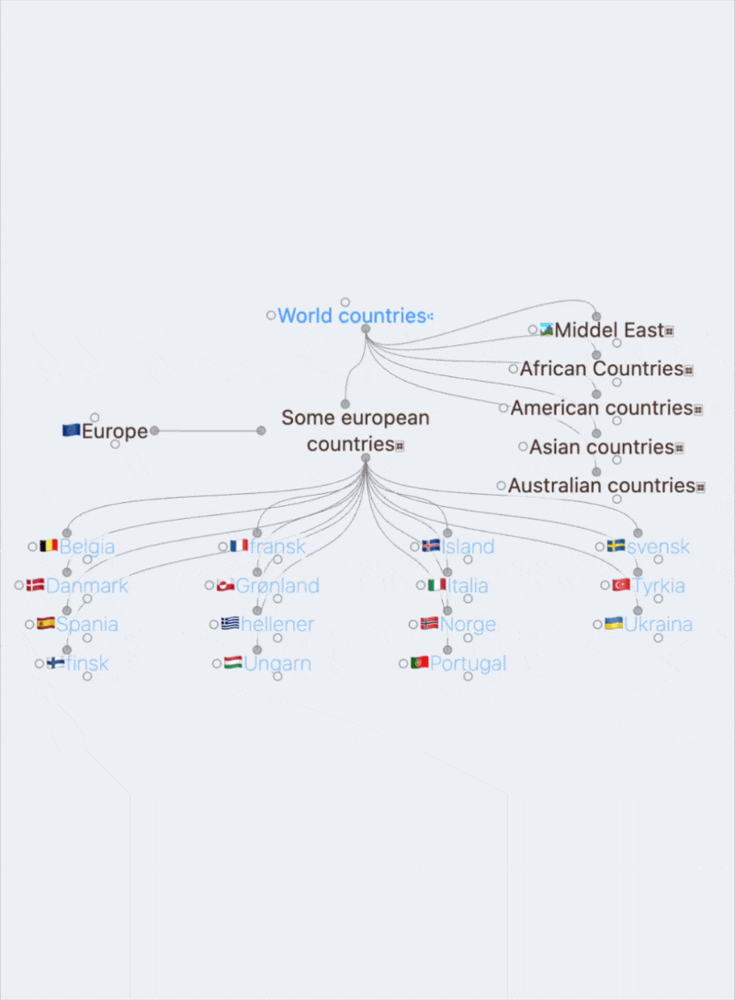
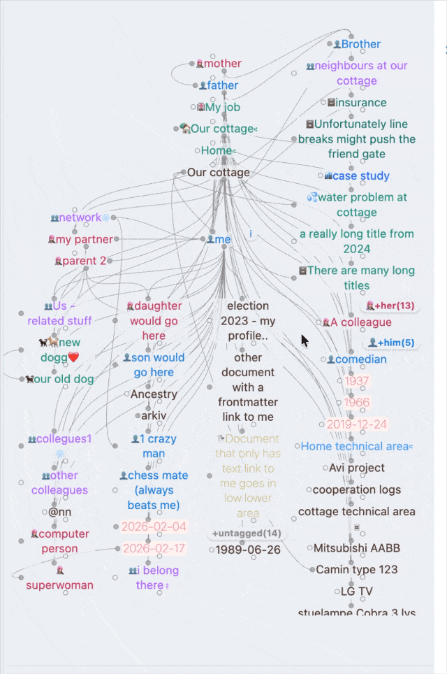

# myBrain for Obsidian

✅ **Now officially available in Obsidian Community Plugins.**

[](https://obsidian.md)
[](https://obsidian.md/plugins?search=myBrain)
[](https://github.com/CarlB01/myBrain/releases)
[](https://github.com/CarlB01/myBrain/blob/master/LICENSE)
[](https://github.com/CarlB01/myBrain/releases)
[](https://github.com/CarlB01/myBrain/stargazers)

> "Structure is liberation. Your notes belong to you, and your graph should think the way you do."

**myBrain** is a high-performance, strictly native semantic network graph for Obsidian.

It organizes your notes into a clean and predictable layout with **Parents · Friends · Center · Children · Siblings** — built for speed, clarity and large vaults.

✨ **What's new in 1.0.19: Colorize Lines & Gates**
This update adds colorization for relationship lines and gate nodes, improving readability and direction-scanning in dense graphs.
It keeps the same core navigation model (Parents · Friends · Center · Children · Siblings) while making complex note neighborhoods faster to parse.

**Typical display**



**In a crowded environment**



---

## 📦 Installation

### Option 1: Community Plugins (recommended)
1. Open **Settings → Community Plugins**
2. Search for **myBrain**
3. Click **Install**, then **Enable**

### Option 2: BRAT (beta/testing)
1. Install the [BRAT](https://github.com/TfTHacker/obsidian42-brat) plugin
2. Open **Settings → BRAT → Add Beta plugin**
3. Enter: `CarlB01/myBrain`
4. Click **Add Plugin**

### Option 3: Manual installation
1. Download the latest release from [Releases](https://github.com/CarlB01/myBrain/releases)
2. Create the folder `.obsidian/plugins/mybrain/` in your vault
3. Place these files in the folder:
   - `main.js`
   - `manifest.json`
   - `styles.css`
4. Restart Obsidian (or reload plugins)
5. Enable **myBrain** under Community Plugins

---

## ⚡ Technical Core & Architecture

Unlike standard chaotic force-directed link graphs, **myBrain** routes information into a highly organized, predictable layout matrix relative to your active focused note.

### 📐 100% Hardware-Accelerated CSS Grid
All node partitions, column expansions, and quadrant assignments are managed **100% by native, hardware-accelerated CSS Grid infrastructure** instead of heavy, laggy JavaScript calculation matrices.

* **Zero Layout-Squeezing:** Nodes are generated in a protective off-screen render curtain (`.is-calculating`) to completely isolate DOM reflows.
* **Predictable Layouts:** Quadrants expand fluidly only when needed, preserving snappier multi-direction responses.
* **Native-style hover previews** — peek at note content on hover, consistent with Obsidian’s own page preview behavior.
* **Excalibrain-like structure** If your existing structure is Excalibrain-friendly and front-matter based there would ble little or no rewrites necessary.
* **Supercharged Links Ready:** Respects your existing tag-based font colors, customized icons, and core appearance settings natively out of the box.

### Flexible workspace placement
The myBrain graph is a normal Obsidian view. Drag its tab and drop it anywhere in the workspace—left or right sidebar, main editor area, or a separate window.

### 🚀 Pure O(1) JIT Cache Performance
* **No Database Bottlenecks:** Bypasses text-parsing chains and heavy queries during active navigation cycles using an advanced asynchronous Just-In-Time (JIT) memory mesh.
* **Instantaneous Cross-Linking ("Baits"):** Nodes dynamically cast multi-directional anchor tokens so that *"everyone discovers everyone"* across massive datasets instantly.

---

## 🎨 Conceptual Layout Matrix

```text
           PARENTS
             │  \
             │   ---┐
             ▼      ▼
FRIENDS ◄► CENTER   SIBLINGS
             │
             ▼
           CHILDREN 
```
### Architectural Mapping Matrix

| Quadrant Area | Target Content Routing | Sourcing Logic |
| :--- | :--- | :--- |
| **`PARENTS`** *(Upper)* | Native structural ancestors and collection headers. | Sourced explicitly via your configured properties/tags. |
| **`FRIENDS`** *(Left)* | Reciprocal lateral relationships and peer connections. | Routed horizontally via direct cross-links. |
| **`CENTER NOTE`** | The active focus anchor context of the current viewport. | Binds the primary origin coordinates live. |
| **`CHILDREN`** *(Lower)* | Downstream target children and unmapped core links. | Sourced from child fields and raw bodytext tokens. |
| **`SIBLINGS`** *(Right)* | Peer cluster nodes sharing a mutual parent anchor. | Tier 1: Verified frontmatter. Tier 2: Bodytext siblings. |

### How undefined nodes are handled
- Links from the center note that are not explicitly defined as children are treated as **undefined** and automatically gathered at the **bottom of the lower area**.
- In the **Siblings** group, undefined siblings are sorted **last**.

### Collapse groups
When a quadrant contains many nodes of the same type, they can optionally be **collapsed** with a **+/- button** to keep the view clean and readable.

---

## 🔒 Privacy & Data Safety

This plugin triggers an automated notice during the Obsidian community review process called **Vault Enumeration** (due to the use of `vault.getMarkdownFiles()`). 

* **100% Local Processing:** This function is strictly used to map note relationships natively and build your semantic graph in real-time.
* **No External Transmission:** No file paths, note titles, or contents are ever sent to external servers, trackers, or third-party APIs. Your data remains completely yours, offline, and inside your vault.

---

## 📰 The Backstory & Legacy

For decades, the semantic power of mapping information into strict **Parents, Children, Friends, and Siblings** relationships belonged to closed, proprietary database silos. As a healthcare professional, I depended on this structured mode of thought every day.

When Licat and Silver launched Obsidian, it felt like home. When Zsolt introduced *ExcaliBrain*, it was a revelation. I even had the privilege of collaborating briefly with Zsolt to help adapt its behavior to real-world semantic workflows.

However, as the years passed, it became clear that a graph framework bolted onto a heavy vector drawing canvas (*Excalidraw*) introduced rigid limitations. It restricted downstream interface interactions and made dynamic scaling harder than necessary.

When Zsolt hinted at gatherings that it was time for a native implementation to take over, I accepted the challenge. I went back to the drawing board—mapping out how nodes could dynamically project into strict semantic quadrants without sacrificing speed.

**myBrain** is the result: a clean, uncompromising, lightning-fast native implementation designed to bring cognitive structure back to the user on their own terms.

---

## 🔮 Roadmap & Future Horizons

This is only the baseline foundation of a completely native semantic framework. Planned milestones include:

- [ ] Interactive context popup menus to add parents/children on the fly.
- [ ] Multi-generation expansion toggles to view grandparents/grandchildren rows.
- [ ] Inline node image decoding when targeted hyperlink references represent image assets.
- [ ] Specialized handling of decrypted content blocks protected by *Meld Encrypt* (if possible).

---

## 🤝 Acknowledgments

This plugin would not exist without the immense inspiration, code legacy studies, and cognitive frameworks pioneered by:

* **Harlan and the creators of TheBrain** for proving that structured association is a beautiful way to organize human knowledge.
* **Zsolt Viczián** for creating *ExcaliBrain*, for the short and motivating period of collaboration, and for inspiring the native renaissance of this structure.
* **Licat and Silver** for giving the world Obsidian, an extensible, local-first ecosystem where we can build anything.

---

*Developed with passion by a healthcare worker who loves graphs and believes semantic structure should belong to everyone. If you enjoy this work, consider starring the repository!*
