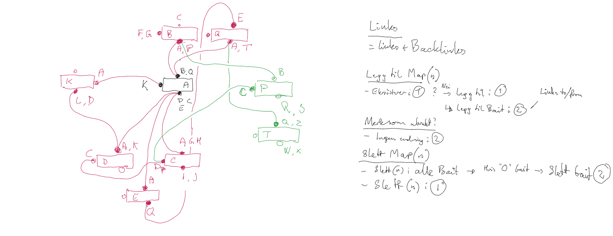
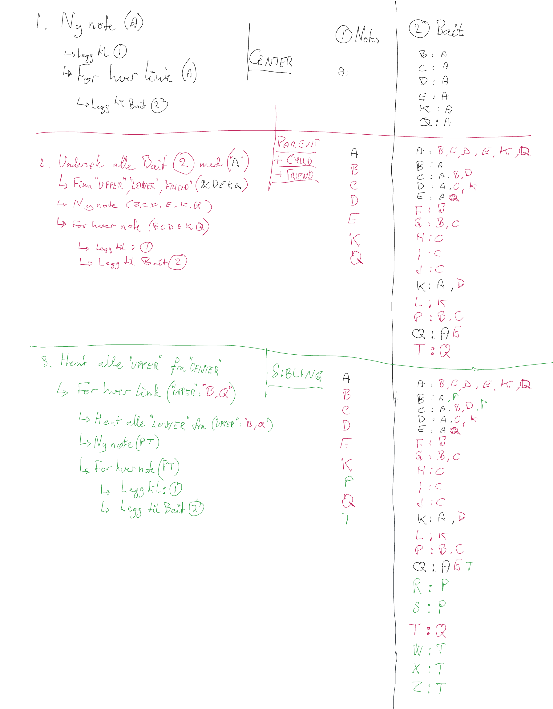

# myBrain for Obsidian

[](https://obsidian.md)
[](https://github.com)
[](https://github.com)

**myBrain** is a high-performance, strictly native semantic network graph view for Obsidian, engineered for maximum speed, structural clarity, and local data ownership.

## ⚡ Technical Core Features
*   **CSS Grid:** Optimized node placements via native CSS.
*   **Performance:** Fast rendering with JIT cache.
*   **Compatibility:** Native integration with ExcaliBrain structures.

## 📰 The Backstory & Legacy
*Se kildekoden for den fulle historien om min inspirasjon fra TheBrain og Zsolt Viczián, samt overgangen til en nativ løsning.*

## ⚙️ Configuration & Metadata
Se kildekoden for eksempler på YAML-oppsett for foreldre, barn, venner og søsken.

## 🤝 Acknowledgments
Takk til Zsolt Viczián for ExcaliBrain og inspirasjon til denne native implementeringen.


# myBrain for Obsidian

[](https://obsidian.md)

<!-- 2. Live GitHub Release Badge (Dynamically tracks your latest tag metrics in orange) -->
[](https://github.com)

<!-- 3. Legal License Badge (Maps a native yellow shield linking straight to your MIT legal file) -->
[](https://github.com)

> "Structure is liberation. Your notes belong to you, and your graph should think the way you do."

**myBrain** is a high-performance, native semantic network graph for Obsidian, designed for speed and clarity. It maps your vault into a predictable vertical and lateral structure inspired by *TheBrain* and *ExcaliBrain*, built entirely from scratch using Obsidian’s internal API for optimal performance, even with 20,000+ notes.

Built 100% from scratch utilizing only Obsidian's native internal API, **myBrain** delivers immediate, flicker-free rendering loops over large-scale vaults exceeding 20,000 notes—all while keeping your markdown files completely offline, local, and private.

 *(Place an animated GIF or screenshot of your view running here)*

---

## 🗺️ The Core Vision & Story

For decades, the semantic power of mapping information into strict **Parents, Children, Friends, and Siblings** relationships belonged to closed, proprietary database silos. As a healthcare professional navigating intensive daily workflows, I searched for alternative architectures that combined this specific cognitive layout with local, secure data ownership. 

When Licat and Silver launched Obsidian, it felt like home. When Zsolt introduced *ExcaliBrain*, it was a revelation. I even had the privilege of collaborating briefly with Zsolt to help adapt its behavior toward sidebar layouts and mobile touchscreens. 

However, as the years passed, it became clear that a graph framework bolted onto a heavy vector drawing canvas (*Excalidraw*) introduced rigid limitations. It restricted downstream interface interactions like native contextual popup menus, localized styling, drag-and-drop mechanics, or integration with decrypting tools like *Meld Encrypt*. 

When Zsolt hinted at gatherings that it was time for a native implementation to take over, I accepted the challenge. I went back to the drawing board—mapping out how nodes could dynamically project multi-directional network anchors ("baits") using links and backlinks so that *"everyone discovers everyone"*. 

**myBrain** is the result: a clean, uncompromising, lightning-fast native implementation designed to bring cognitive structure back to the user.

---

## 🗺️ The Core Vision

**myBrain** brings strict, contextual structure (Parents, Children, Friends, Siblings) to Obsidian without the overhead of heavy vector canvases, allowing for a faster, more integrated experience.

## 🎨 Conceptual Architecture

**myBrain** organizes your knowledge in a predictable, focused layout.

```text
        [ PARENTS ]         ◄── Upper Area
            ▲		     
        	│                
 [ FRIENDS ] ◄► [ CENTER]   [ SIBLINGS]
            │
            ▼
        [ CHILDREN ]        ◄── Lower Area
```

### Architectural Mapping Matrix

| Quadrant | Sourcing Logic |
| :--- | :--- |
| **`[ PARENTS ]`** | Upper area; direct structural ancestors. |
| **`[ FRIENDS ]`** | Left area; reciprocal, lateral peer connections. |
| **`[ CENTER ]`** | The active note and current context. |
| **`[ CHILDREN ]`** | Lower area; downstream targets and core links. |
| **`[ SIBLINGS ]`** | Right area; peers sharing a mutual parent. |

---

## 🚀 Key Features

* **Instant Migration for ExcaliBrain Users:** If your data is already shaped for ExcaliBrain, it is 100% compatible with **myBrain**. Your years of structured tags and YAML properties will render instantly on day one!
* **Pure Native Performance (O(1) JIT Cache):** No heavy database queries or text parsing chains during navigation. The engine utilizes an advanced asynchronous Just-In-Time (JIT) memory mesh. redrawing networks over massive 20,000-item vaults in under a few microseconds.
* **Flicker-Free "Iron-clad" Rendering:** Employs an off-screen render curtain that stabilizes column expansions and layout shifts in total darkness before gracefully illuminating elements simultaneously.
* **Supercharged Links Ready:** Designed to natively blend with your custom theme environments. It respects your existing tag-based font colors, customized icons, and appearance rules out of the box.
* **Fully Responsive & Searchable Panel:** Fully optimized for both desktop sidebars and native iOS/Android sliding mobile drawers, utilizing an elastic SVG layout. Fully compatible with Obsidian's modern searchable plugin settings.

---

## 📐 The Design & Blueprint

Below is the original conceptual blueprint mapping out how nodes cast multi-directional bidirectional anchors across the cache matrix:





---

## ⚙️ Configuration & Metadata Rules

You can fully customize which YAML properties or frontmatter tags dictate the layout quadrants inside the plugin settings panel.

### Example Frontmatter Structure:
```yaml
---
tags:
  - #collection
title: "Europe"
parents: "World Countries"
children:
  - "Norway"
  - "Belgium"
  - "Italy"
partner: "European Union"
---
```
* **Parents Quadrant:** Triggered by frontmatter properties like `parent` or tags like `#major`.
* **Children Quadrant:** Triggered by properties like `child` or `members`.
* **Friends Quadrant:** Routed laterally from fields like `partner`.
* **Siblings Quadrant:** Discovered dynamically by finding other items sharing a mutual parent element.

---

## 🔮 Roadmap & Future Horizons

This is only the baseline foundation of a completely native semantic framework. Planned milestones include:
- [ ] Interactive context popup menus to add parents/children on the fly.
- [ ] Multi-generation expansion toggles to view grandparents/grandchildren rows.
- [ ] Inline node image decoding when targeted hyperlink references represent image assets.
- [ ] Specialized inline visualizers to handle decrypted content blocks protected by *Meld Encrypt* (i hope).

---

## 🤝 Acknowledgments

This plugin would not exist without the immense inspiration, code legacy studies, and cognitive frameworks pioneered by:
* **Harlan and the creators of TheBrain** for proving that structured association is a beautiful way to organize human knowledge.
* **Zsolt Viczián** for creating *ExcaliBrain*, for the short and motivating period of collaboration, and for inspiring the native renaissance of this structure.
* **Licat and Silver** for giving the world Obsidian, an extensible, local-first ecosystem where we can build anything.

---

*Developed with passion by a healthcare worker who loves graphs and believes semantic structure should belong to everyone. If you enjoy this work, consider starring the repository!*
